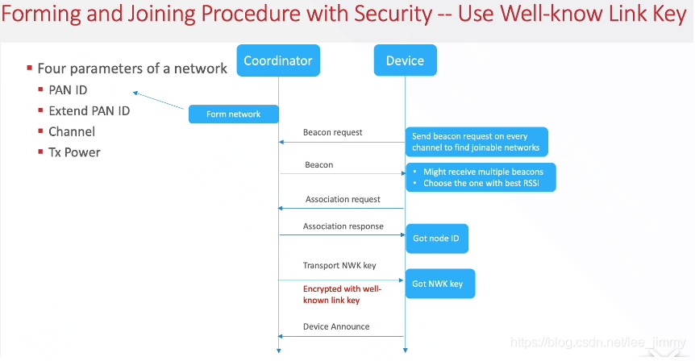
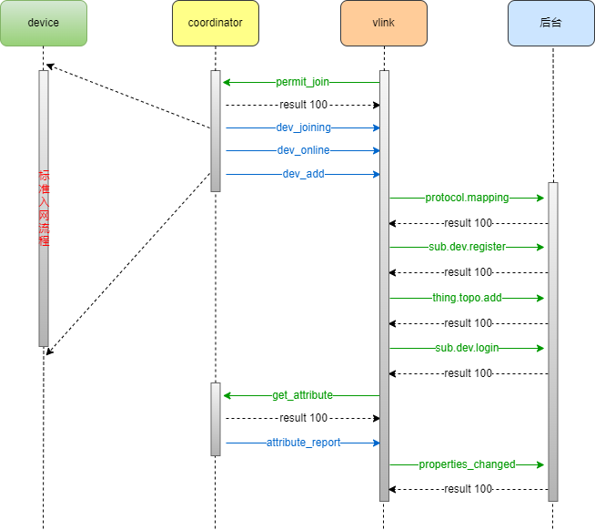

### ZigBee设备的入网流程

下图是ZigBee设备标准的入网流程

下图为云米ZigBee设备入网流程（包含标准流程）

结合如上两图，分析ZigBee设备与coordinator（网关）的入网流程在云米入网流程中的位置：

1. 网关发送permit joining request广播，允许设备入网，时长一般为180s。（** permit_join **）
2. ZigBee子设备重置后，将在每一个信道发送beacon request广播（地址为0xFFFF）。
3. coordinator收到beacon request后，回复beacon，beacon包中包含是否允许该设备入网，节点深度，是否接入当前设备类型等。（** dev_joining**）表示开始和device进行入网流程了。
4. ZigBee设备收到beacon回复（可能收到多个coordinator回复的beacon），根据是否允许入网以及信号强度（RSSI）选择一个coordinator，向其发送association request请求入网。
5. coordinator收到association request后，将根据当前资源情况决定是否允许其加入，若允许，则为其分配短地址（node id），并返回association response。
6. coordinator下发网络key给ZigBee设备，用于通讯。
7. ZigBee设备收到key，便向网络中发送一个device announce的广播报文（地址为0xFFFF），宣布自己入网以及有哪些设备信息。（** dev_online**）
8. coordinator将入网的设备信息发送给vlink。（** dev_add**）表示已经成功完成入网流程入网了。
9. 网关根据ZigBee设备的产品表信息，向后台获取该产品的协议映射文件，用于创建设备节点。（** protocol.mapping**）
10. 向后台注册该设备。（** sub.dev.register**）
11. 向后台添加topo结构。（** thing.topo.add**）
12. 向后台通知上线状态。（** sub.dev.login**）
13. 网关主动获取该设备的相关属性。（** get_attribute**）
14. ZigBee设备上报相关属性。（** attribute_report**）
15. 网关将设备的属性变化发送到后台。（** properties_changed**）