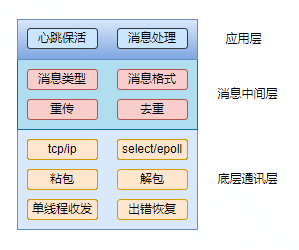

### 一些重点总结

0. **编程和行业知识基础能力**

1. **理解需求和拆分需求的能力**
2. **根据需求开发代码架构的能力（设计模式）**

3. **代码重构的能力**

#### 0. 自我介绍

应从个人基本情况，过去做什么，现在做什么，未来打算做什么展开介绍

1. 基本情况

2. 过去做什么

3. 现在做什么

4. 未来打算做什么

   

**问题1描述**：前段时间遇到一个问题，局域网中保证传输质量的重传机制总是发生重传，但是对端却收到重复的数据，做了重复的动作。

经过排查发现发送方第一次发送的数据对端成功收到且回复发送方这则消息，但是发送方没有收到回复确认，1.5秒后触发了重传。

关于发送方没有收到这则回复的消息刚开始猜测：第一、 发送方的接收缓存满了，导致对端的发送窗口变小，数据卡在对端的发送缓存里；第二、 数据成功发送到了发送方的接收缓存中，但是发送方的消息处理速度过慢，导致这则消息1.5秒内没有被处理。

这两种猜想大都是一个原因，不管是发送方的接收缓存满了，还是消息被搁置了1.5秒内没被处理，都说明发送方对数据的处理速度不够，导致堆积或迟滞处理。

后查看代码发现，一个线程的loop只处理一个device的一则完整消息，而非接收缓存中该device的所有消息，因为采用的是固定头的粘包处理方式，且在接包的时候是一次只接一个包，如果通讯数据太多就会导致有些包接收的太慢，造成数据的未及时处理。

最后将消息方式修改为：一个线程的loop最多处理m个device，每个device最多处理n个完整消息，加大了数据的处理速度，经过测试发现在复杂场景执行时，局域网通讯数据量很大的时候也没有出现此问题了。

#### 1. 局域网通讯模块设计要点

协议类型（tcp/udp），消息格式（json/xml），IO复用模型（select/epoll），粘包（固定头），解包与处理， 心跳保活（Keepalive），出错恢复（重连），消息重传与去重，发送与接收缓存，以及单线程收发。

局域网通讯模块的设计从上到下主要包括：应用层（根据需求，对局域网消息进行处理和动作，心跳保活等），消息中间层（局域网的通讯协议的制定，包括：消息类型，消息格式，消息重传与去重），底层通讯层（协议类型，IO的复用模型，处理粘包的方法，解包与处理，单线程收发，出错恢复（重连）等）

**采用上诉模块分层思想重构局域网通讯的代码，重在通讯层，其他可以简化**

**选择select还是epoll**：select采用轮训的方法遍历所有添加的fd是否有IO事件发生，且其最大连接数有限制，默认1024，且维护1024个fd的数据结构很占用内存；epoll则根据活跃的fd，直接调用相应的callback函数来通知IO事件的发生，无需轮询，且其连接没有数量限制；

从表面上看epoll的性能最好，但是在连接数少且十分活跃的情况下，select性能比epoll好，因为epoll的通知机制需要很多的函数回调；而select效率低在于每次都要轮训，但是如果连接数不多而且每个连接都很活跃，那么select的效率就高得多，所以两种复用IO的选择，应视情况而定。

#### 2. 场景本地化实施的重难点

1. 网关与云端的消息交互接口选择，是选用MQTT还是HTTP，所涉及的功能需求有：

   *场景控制器的选择。云端根据相应的策略选择哪个网关作为场景的控制器？网关启动需向云端同步场景控制器信息来决定自己是什么角色，云端场景控制器发生变化主动通知网关同步，该过程数据量小，一般采用MQTT。

   *场景列表的同步。将云端的场景列表同步到场景控制器，场景信息数据量大，采用HTTP。

   *云端场景变更的主动通知。该消息只是通知场景有变化，具体的变化还是要走一遍场景列表同步的流程，故采用MQTT。

   *场景执行日志上传，数据量小，采用MQTT。

   **以上完成了网关与云端数据交互的部分**

2. 局域网通讯模块的设计。包括协议选择，IO复用模型，粘包与解包，出错恢复，消息的类型与格式（通讯协议），消息重传与去重，心跳保活等。

   **以上完成了局域网通讯的部分**

3. 数据安全，消息的加密算法选择。

   **以上完成了网关与云端数据交互安全以及局域网之间通讯数据交互安全部分**

4. 场景触发器的设计。按场景的触发来源可将触发设备分为：作为场景控制器的网关自身子设备触发，作为场景控制器的网关屏端场景卡片触发，作为非场景控制器的网关自身子设备触发，作为非场景控制器的网关屏端场景卡片触发，作为WiFi设备屏端场景卡片的触发

   **以上完成了场景触发器从云端转移到边缘设备的功能**

5. 场景日志保存

   **以上完成了向云端上传场景执行日志的部分**

#### 3. 产品需求发展方向

1. **拿到需求如何分析并将其拆分为可独立开发或者可独立交付的细分模块。**
2. **分析拆分后的模块采用何种设计模式或架构来编码**
3. **各模块开发完，组合起来之后的可能涉及的代码重构**
4. 测试交付

**从负责整体项目上来看的话就是代码架构的设计和整个项目的构建，主要使用cmake自动构建**

（shell脚本，bat脚本，cmake，Makefile，）

#### 4. 软件硬实力

学习开源软件，了解软件架构的设计

主要有：libevent， Linux-0.01源码，socket，cJSON，tinyhttpd，tinyssdp，triggerhappy等

tinyhttpd：一个轻量的HTTP服务器（B/S模型），底层是典型的socket通讯，通过tcp三次握手建立tcp/ip连接后，浏览器向该服务器主机发送HTTP的GET或POST请求，服务器根据请求的方法和内容确定返回静态页面还是CGI脚本运行结果，如果是静态页面直接读文件返回给浏览器即可，如果是需要返回CGI脚本运行结果，则需创建父子进程，子进程负责运行CGI脚本并将结果返回给父进程，父进程通过socket将其发送给浏览器，父子进程之间的通讯使用管道的方式

tinyssdp：（简单服务发现协议)是一种用于小型网络(包括家庭网络)的网络发现协议，主要用于同一网络或同一WiFi热点的家庭设备的相互发现。参照该协议，本地场景中网关的设备的相互发现采用UDP组播的简单实现

triggerhappy：是一个监测输入事件的守护进程，它会监控指定的输入设备文件，解析接收到的事件数据并根据配置的触发文件内容执行用户指定的操作，非常适合小型的嵌入式系统

#### 5. 场景本地化

项目整体的架构是采用module的方式，个

采用三个线程处理，其中两个分别作为同网关场景和跨网关场景的触发执行线程，另一个为局域网通讯的线程，场景采用异步触发方式；本地场景实施主要有数据同步接口设计，场景执行器设计，局域网通讯模块的设计。

接口设计选用HTTP/MQTT接口，涉及数据有：后台场景列表，主控器信息，场景执行日志，场景列表变化更新消息

场景控制器，分为触发器和执行器，触发后异步执行

局域网模块，采用tcp协议，通讯协议制定，select IO复用模型，固定头解决粘包，应用层加心跳保活，断线及时重连

难点：
