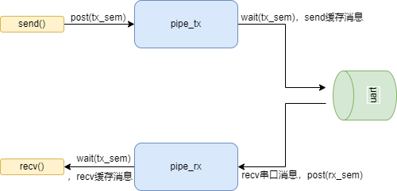

### 串口流控架构

vlink与模组之间的串口通讯采用以下的流控架构，主要采用管道作为消息的缓存，用信号量来同步消息的接收和发送。

如上图，简述一下vlink到模组之间的消息流：

1. 上层应用调用通用的send接口，将消息写入到发送队列（pipe_tx），随后释放信号量tx_sem
2. 发送线程获取到信号量tx_sem，从队列（pipe_tx）中获取一则消息发送到串口
3. 接收线程recv到串口消息后，将消息写入到接收队列（pipe_rx）,随后释放信号量rx_sem
4. 处理线程获取到信号量rx_sem，从队列（pipe_rx）中获取一则消息处理并回调通用的recv接口

以上4个步骤为基本的串口通讯流控流程，另外为了保证通讯的可靠性，需要加上重传和回复验证， 本项目同样采用信号量（response_sem）方法来实现，具体如下：

1. 需要重传的消息的消息体中的opcode为特殊的操作码，发送带有对应opcode的消息，需要设置一定时间的信号量（response_sem）超时等待，在规定的时间内未收到信号量便重传或重置芯片，目前是重置芯片
2. 另外模组端收到对应特殊opcode的消息后，回复时消息带上对应的opcode，处理线程在处理该消息时，将标识有特定opcode的消息释放一次信号量（response_sem），不带有该特殊opcode的消息按上图正常通讯，不影响该信号量

​	缺点：超时时间内只能确认有消息没回复，不能确定是哪一条消息没回复，因为信号量并不记录消息id；目前没有重传，采用重置芯片的方法，可以考虑加上重传机制。