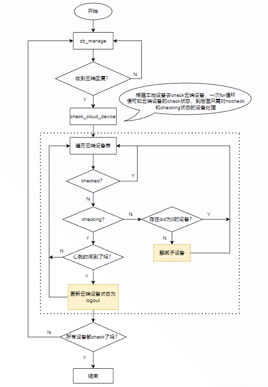

### 云端与网关子设备状态同步

#### 背景：

一些特殊情况，如子设备断电后，网关立马重启，由于监测机制的局限性，云端有时并不知道网关离线了，自然该断电的子设备在云端就一直处于在线状态，而网关侧已经没有了该子设备，两侧的子设备状态不符。经讨论确认使用[gateway.subdevice.info](http://gateway.subdevice.info/)消息向云端获取网关的子设备，并在回复中新增子设备的online状态字段，用于网关本地子设备状态同步。

#### 具体策略：

1. 查询子设备状态时机：每次重启或者重新联网后，在9次recheck_all_sub_dev完成之后发送该消息向云端查询。该时机保证大部分的子设备均可以连上网关，在睡眠中尚未连上的后面有其他策略处理（等待心跳）。
2. 两侧同步逻辑：网关将云端回复的子设备保存在本地静态表；收到云端子设备后将云端设备表与本地dev_table进行check，有交集的设备，根据本地状态判断是否上报login或logout，云端多的设备发送解绑，本地dev_table多的设备则从flash中删除。

