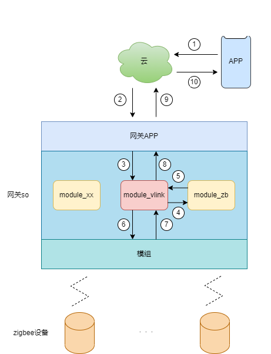

### 命令控制流

命令流示例：

#当前流程默认网关为在线状态下。

1. 手机app端控制子设备动作：

   1 (HTTP的post方法下发set_properties) -> 2 (后台将此消息转为MQTT消息发布) -> 3 (MQTT透传) -> 4 (vlink发送zb) -> 5 (zb将VIOT协议转换为ZigBee协议) -> 6 (下发转换后的ZigBee cmd) -> 7 (ZigBee设备收到属性设置并响应，上报变化后的属性attribute_report) -> 4 (vlink发送zb) -> 5 (zb将ZigBee协议转换为VIOT协议) -> 8 (上传属性变更properties_changed) -> 9 (MQTT透传) -> 10 (HTTP post属性信息给APP) 

   

