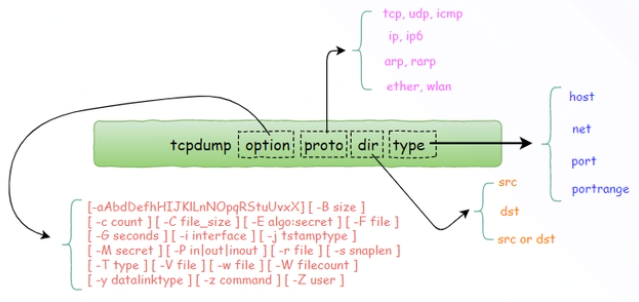

#### 工作相关命令

```C
adb connect ip:5555 
adb -s ip:5555 disconnect
adb -s 序列号 shell
    
adb shell setprop exempt.adb.root 1
adb root
adb remount
adb logcat -G 20m
adb shell    

adb pull /data/user_de/0/com.viomi.coreservice/logs

adb push .\libviotlink_a.so /data/app/com.viomi.homepadQUsPreFmupHVD27xlBnLiw==
/lib/arm/

logcat | grep -E "viotlink"
    
adb install -r xxx.apk

find /data/app/ -name "vioytlink_a.so" > so_path.txt
    
pidof <进程名>
top -p <进程号>
    
./arm-linux-androideabi-addr2line.exe -f -C -e D:/0_work_0/code/lot-viomi/gateway_demo/viotlink_gateway_android_demo/app/libs/armeabi-v7a/libviotlink_a.so 
    
```


```C

git checkout -b homepad origin/homepadplus/release-2.2.0
查看所有分支
git branch -a
查看所有远程分支
git branch -r
移除本地分支
git branch -d homepad
重命名本地分支
git branch -m new_homepad
放弃工作区的更改
git checkout <file_name>
放弃所有更改
git checkout .
git reset --hard HEAD^1
git config --global user.email "jichuandong@viomi.com.cn"
git config --global user.name "jichuandong"

git push origin jcd_local_dev:jcd_remote_dev
    
git commit -m '添加boby sensor的新增属性'
git commit --amend -m '使用新的commit来代替上一次提交的commit'
    
git log --author=jichuandong --oneline --graph -30
```


```
切换到测试环境：
1. 修改pid为测试环境的pid  673-> 756
ViomiHomePad\homepad_common\build.gradle
    
2. 调用vlink库，设置测试环境为true
ViomiHomePad\module_viot_zigbee\src\main\java\com\viomi\zigbee\ZigbeeManager.java
    
3. 修改私钥
ViomiHomePad\module_viot_device\src\main\java\com\viomi\viot\device\SecretKeyUtils.java
    
4. 在设置里面，点击网络名称5次，设置一键切换到测试环境为true
5. 切换pad用户到测试账号
```


```
write 1 0xFFE0 9 1 0x20 "1"\r
zcl glo report 1 0xFFE0 9 1\r
send 0 1 1\r

其中有三个地方需要关注：
9：属性值
0x20:数据类型
“1”：要上报的值
```


```
测试环境账号更换：
admin1
Viot12345@
```

```
master的虚拟界面：
# 进入首页

# 进入系统设置
am start -n com.android.settings/.Settings

master网关user版本获得adb权限方法：
1、按住场景按键（顶部中央按键），快速按2下设置按键（侧边按键）。
此时可以使用adb
2、重启后会关闭adb。需要长期保持adb打开。可以使用如下flag
adb shell setprop exempt.adb.root 1
adb root
adb shell
setprop persist.debug.usb

# 查看系统的一些属性配置
getprop |grep viomi
# 设置系统的一些属性
setprop persist.viomi.pid 1827

# 卸载相关应用
adb uninstall com.viomi.vmscore
adb uninstall com.viomi.homemap
adb uninstall com.viomi.gateway
```


```
mongoDB
对比同文档里的两个字段
$expr:{$ne: ["$actualExecuteType","$originSceneType"]},
```




```
tcpdump
#抓取源地址为192.168.10.100发送到当前主机的数据包
tcpdump src host 192.168.10.100

#抓取发往源地址为192.168.10.100主机的数据包
tcpdump dst host 192.168.10.100

#抓取源地址为192.168.10.100发送到当前主机的数据包并保存到文件
tcpdump src host 192.168.10.100 -w tcp.pcap

```


```
#查看某个进程的线程

ps -T -p <pid> 或 top -H -p <pid>

#strace追踪进程
strace -p <pid>

#strace追踪线程
方法一
先用ps -T -p <pid> 或 top -H -p <pid> 查出线程tid。
然后strace -p tid追踪其中一个线程。

方法二
直接用strace -fp pid追踪进程下所有线

#要跟踪某个具体的系统调用，-e trace=xxx
-e trace=file     跟踪和文件访问相关的调用(参数中有文件名)
-e trace=process  和进程管理相关的调用，比如fork/exec/exit_group
-e trace=network  和网络通信相关的调用，比如socket/sendto/connect
-e trace=signal    信号发送和处理相关，比如kill/sigaction
-e trace=desc  和文件描述符相关，比如write/read/select/epoll等
-e trace=ipc 进程见同学相关，比如shmget等
```


```
#查询端口号为9868的消息
tcpdump src port 9868

#ping相应IP
ping 192.168.xx.xx

#查看对应IP的MAC地址，根据MAC地址向后台查询设备
cat /proc/net/arp
```


```
查看串口详情
stty -F /dev/ttyS0 -a
```

