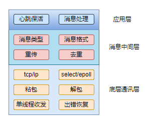

### 网关学习笔记

#### 1. 设备注册到网关的大致过程

1. 产品做出物模型并生成json配置文件.

2. 上传该json文件到云端.

3. 设备申请加入到网关时，网关拿到pid去云端申请获取该设备的json文件接口，拿到该文件后将文件通过vlink透传给接口add_product，该接口解析json并创建cluster等，完成新产品的创建。的内容填充给新设备的设备结构体，包含siid,piid,aiid,eiid，分别对应服务、属性、方法以及事件.

   总的来说，设备注册时网关会拿到json信息来填充这个新设备的devicenode.

#### 2. zigbee和viot之间的协议转换实质

实现方法为：在物模型的json文件中建立这两个协议之间的映射关系，如viot主要识别的为siid和piid，zigbee主要识别的是cluster和cmd，文件中建立这两组参数之间的关系，并再添加设备时将这些标识填充给devicenode对应的成员变量，在信息交互的过程中就可以根据这些标识的具体值来做相应的转换，也就完成了协议之间的相互转换。

#### 3. module_vlink与module_zb之间的交互方法

1. zb->vlink:通过module_function的方法将vlink的接口以cmd_message的形式提供给zb等其他模块，当zb需要调用vlink里面的方法，通过module_function发送对应的cmd即可。
2. vlink->zb:通过module_function的方法将接口以回调的方法初始化给vlink_peri_handle结构体的callback，当vlink需要调用zb里面的方法时，通过该设备的设备资源直接访问到zb的方法接口。

#### 4. message queue的消息发送和接收逻辑

见下图：


该消息队列的模型是发布与订阅模式，每个module都发布和订阅消息，当然也会订阅自己发布的消息，而mainprogram线程是主线程同时也是该模型的broker，即消息代理。每个module都有两个消息队列，一个global message是指向mainprogram的消息队列，即module发送消息时会调用global 队列将消息发给broker；一个local message是本模块接受外部消息的队列，即broker发送过来的消息是通过local队列接收。

例：如vlink想要发消息给mcu，则vlink先通过global队列将消息发给broker，broker接受到消息判断是否是发给自己处理的，如果不是就将这个消息发给目标线程的本地队列，也即mcu的local队列，这样mcu就接到vlink发送过来的消息。<font color='red'> 另外如果vlink想要发送消息给vlink，那么也需要先通过global队列转发给local队列。 </font>

疑问：为什么发给自己还要从主线程转一下，而不是直接发给自己的local队列呢？

#### 5. 线程结构

见下图：


该网关功能的线程结构如上，下面介绍一下各线程的功能：

sys:程序的一些特殊的参数配置

trm:虚拟终端线程，用于处理终端指令，便于调试使用。

pm:初始化串口和管道，用于各线程之间的cmd message传输

mcu:

bind:

疑问：为啥sys与pm线程要初始化两次呢？

答：<font color='red'> 实际上程序的开始并不是main函数，而是Java端的jni接口 </font>，所有的线程创建等动作都是Java端调用jni接口实现的，该接口为：jni_native_native_init，该接口为网关所有代码的总入口。

#### 6. JNI接口

native方法包含Java端调用原生端方法和原生端回调Java端方法，实现两端的相互调用以及参数传递。Java调用的原生接口一般采用module function方法

Java端调用原生端接口的方法为：Java端以get不同的native方法来调用原生端的接口，原生端的接口呈现一般为module_function方法。

原生端调用Java端接口的方法为：Java端的接口会以callback的形式注册它的功能接口，原生端通过调用该数据结构中的函数指针来调用到Java这边的接口。

#### 7. 几个常用关键接口解析

```
1. vlink_device_parse_cmd
```

该接口为vlink模块接受并解析命令的总接口，其中包括硬件模组发过来的cmd以及相关应用模块发过来的消息，主要功用为vlink模块与其他应用线程模块以及硬件模组之间的交互，交互通路为pm应用线程创建的串口方法

各模块与vlink之间的交互包括cmd message等均是通过module_function的方法实现，其中包括vlink主动发命令请求相关模块回复以及相关模块主动发送状态的变化

``` 
2. zb_ext_access_prop_cb
```

该接口为ZigBee应用层解析vlink_recv接口收到并转发到该接口的云端消息，方向为：云端->vlink->zb应用层->vlink->硬件模组

```C
3. zb_ext_mcu_parse_cmd_cb
```

该接口为zb应用层接受模组发过来的消息，并处理后将结果上传到云端，实际上模组发过来的消息会先经过vlink_device_parse_cmd接口解析，然后转发到该接口处理，方向为：硬件模组->vlink->zb应用层->vlink->云端

从上面不难发现，模组以及云端和网关的交互均是通过vlink这个桥梁来实现的，zb以及蓝牙mesh等上层协议模块与模组或云端的交互都得通过vlink。

```
4. common_upload
```

该接口为vlink发送数据到云端的总接口，至于调用该接口的具体作用通过其中的method参数鉴别，目前有如下方法：

```C
typedef enum {
    PROP_CHANGED,
    EVENT_OCCURED,
    LOG_REPORT,
    DEV_INFO,
    DEV_VERIFY,
    DEV_UPG_PRO,
    OTA_GW_REPORT,
    DEV_RESET_REPORT,
    DEV_TB_REQ,
    DEV_REGISTER,
    RESULT_REPLY,
    THING_TOPO_ADD,
    SUB_DEV_LOGIN,
    SUB_DEV_LOGOUT,
    SUB_DEV_INFO,
    DEV_CONN_PING,
    DEV_GROUP_PULL,
    MAX_METHOD,
} vlink_method_e;
```


#### 8. 从命令流来分析网关的工作流程

见下图：


##### 网关联网的情况：

1. 手机app控制zigbee设备动作：1->2->3->4->6->7->8->5->6->9->10->11
2. zigbee设备主动动作：8->5->6->9->10->11
3. 网关上的实体按键控制zigbee子设备动作：10->2->3->4->6->7->8->5->6->9->10->11

##### 网关未联网状态下本地场景：


#### 9. 网关添加新设备流程

见下图：


#### 10. 使用指针时，一些需要free的接口及结构

1. jstring_to_char
2. asprintf
3. viomi_json_pack
4. JSON_REQ_PARAM_ARRAY
5. 注意链表节点的释放层数（写链表时不用释放，取链表且要移除才释放节点）
6. 注意结构体里包含指针的释放

#### 11. 本地场景逻辑分析

联网状态下上线：

1. 子设备正常入网get mapping文件时同时备份一份放在链表中，随后<font color='red'> 异步 </font>的存储到数据库中
2. 子设备正常login，并在手机端创建本地场景
3. 本地场景线程定时的去云端拿最新的本地场景的配置信息到本地场景链表

网关离线：

4. 子设备动作上报属性变化，vlink_properties_changed_handle检测到属性变化并判断网络状态，若离线便call到本地场景的属性变化接口，将当前的属性状态<font color='red'> 保存到链表 </font>并将场景链表中此场景状态设为击中，随后本地场景线程<font color='red'> 异步 </font>执行击中的场景；若在线也call到本地场景的属性变化接口，但仅仅将属性变化状态保存到链表而不执行，执行该场景走正常有网络是的情况。

离线状态下重启：

5. 重启后网关会定时向存在flash中的设备发送get_attribute，随后子设备report属性（当然也有设备主动上报属性变化，这时就不用get_attribute了）同时加入uncategroized链表，vlink线程定时检测该链表里存在的设备，如果存在就去数据库查找该设备的mapping文件，如果找到便添加该产品到chainnode，随后将该产品信息放入到unregistered链表中，等待联网后注册。
6. 同4

网关重新联网：

7. 联网情况下，vlink线程会定时去查看untopo, unregistered, uncategroized链表中是否有设备，如果untopo链表中存在就login；如果unregistered链表中存在就register->add_topo->login；如果uncategroized链表中存在就去后台get对应的mapping文件，如果get到了就走正常的入网流程

#### 12. ROM和RAM

1. rom: 为只读memory，通常称其为”外存“，即<font color='red'> 存储 </font>器，如硬盘、ssd、emmc等

2. ram: 为随机memory，通常称其为内存，用于执行程序和数据<font color='red'> 处理 </font> ，常提到的内存5区便指ram中

3. 内存映射：如32位的处理器，它的每个进程地址空间为4G，这个4G是虚拟内存，它实际上会映射到实际的物理内存，即ram中，但是ram往往没有这么大，可能是2G，也可能只有512M，而该设备可能有几十个进程，那么这几十个4G的虚拟内存空间都会映射到实际上只有512M的物理内存

4. 内存5区：栈区、堆区、全局区、常量、代码区


网关开机时，so库是存储在emmc上的，即rom中，加载动态库时，cpu会将rom中的代码及数据拷贝到ram中，并为so库中对应的进程映射0-4G的虚拟地址空间，但并不是将so全部拷贝到内存中，而是采用延迟绑定的方式按需加载代码段和数据的，所以使用top指令查看的动态库占用大小往往小于实际大小（可是为什么top指令下动态库的大小不随程序的运行而变化呢？）

答：top指令分配这么多，其实是将rom中完整的so映射到虚拟内存上，所以显示的大小基本一致，但事实上分配的物理内存并没有那么多，而是采用延迟加载的方式，按需的将代码和数据加载到实际物理内存的。

#### 13. 记一次crash

```
int qury_child_node_dev_by_did(long long did)
{
    if (did <= 0) return -1;

    for(int i = 0; i < LOCAL_DEVNODE_SUPPORT_MAX; i++) {
        if (childnode[i].endpoints_info[0].did == did) {
            return 0;
        }
    }
    return -1;
}
```

如上代码：遍历所有子节点来匹配对应的did，但是endpoints_info是一个指针，当遍历到空的childnode，即endpoints_info指针指向NULL，但这时仍去访问endpoints_info指针对应的结构变量did就会造成内存操作错误，从而crash。将LOCAL_DEVNODE_SUPPORT_MAX改为childnode_num即可。

#### 14. token的作用

1. 防止表单重复提交，占用CPU资源，用于性能考虑。
2. 验证身份的有效性，防止遭受攻击，用于安全考虑。

#### 15. 动态库的加载以及访问


如上图：动态库是被加载到位于堆栈之间的一个固定起始地址的，至于怎么加载，加载多少完全由加载动态库的接口的相关参数决定

<font color='red'> 每个可执行程序链接到动态库时只是在程序内部做了一个链接记录，并不会把动态库复制到可执行程序本身 </font>

加载动态库的接口如下：

1. void* dlopen(char const* filename,int flag); // flag一般就指系统已经分配好的宏

   功能：将共享库载入内存并获得其访问句柄

   参数：filename 动态库路径，若只给文件名不带目录，则根据LD_LIBRARY_PATH环境变量的值搜索动态库

   flag 加载方式，可取以下值：

   ​	   	<font color='red'> RTLD_LAZY -- 延迟加载，*使用动态库中的符号时才真的加载进内存*</font>

   ​			RTLD_NOW --立即加载  

   返回值：成功返回动态库的访问句柄，失败返回NULL

   句柄：<font color='red'> 句柄唯一地标识了系统内核所维护的共享库对象，将作为获取函数调用的参数 </font>

2. void *dlsym(void* handle,char const* symbol);

   功能：<font color='red'> 从已被加载的动态库中获取特定名称的符号地址 </font>

   参数：handle 动态库访问句柄

   ​            symbol 符号名

   返回值：成功返回给定符号的地址，失败返回NULL

   该函数所返回的指针为void*类型，需要造型为与实际目标类型相一致的指针，才能使用

   例如

           int (*add)(int,int)=(int (*)(int,int))dlsym(handle,"add"); // add是函数名
           if(!add){
           	fprintf(stderr,"获取地址失败！\n"); 
           	exit(EXIT_FAILURE);
           }
           
           int sum = add(30,20)


3. int dlclose(void* handle);

   功能：从内存中卸载动态库

   参数：handle 动态库句柄

   返回值：成功返回0，失败返回非0

   所卸载的共享库未必会真的从内存中立即消失，因为其他程序可能还需要使用该库，只有所有使用该库的程序都显示或隐式地卸载了该库，该库所占用地内存空间才会真正得到释放，无论所卸载地共享库是否真正被释放，传递给dlclose函数地句柄都会在该函数成功返回后立即失效，即任何有关句柄的操作都失效

   

根据以上接口的描述可知：

		1. 动态库是加载到（映射）堆与栈之间的固定起始地址的内存区域
		1. 动态库不会将代码段和数据段展开到进程空间的内存4区中，而是保持在对应的内存位置等待访问
		1. 访问动态库时，会调用dlopen函数获取对应动态库的句柄，调用dlsym函数获取指定函数名所对应的代码执行地址

#### 16. 多网关协同以及单点故障避免


1. 模型描述：多网关协同采用master与slaver的方式，仅为master的网关才有资格与云端通讯，网关间通讯通过局域网的TCP/IP协议实现，master为server，slave为client。

2. 实现方法：云端下发指令，master网关本地执行同时透传指令到其他网关，其他网关判断是否有自己的事件来执行相应的联动。

3. 单点故障避免：采用单个网关均保存其他网关的device_table以及mapping文件等实现，这些文件与网关的IP相对应。

   若slaver离线或关机，master检测到这一事实，使用保存的该网关的device_table与mapping等来暂时接管该网关的子设备，并帮助其执行，若该网关重新上线，仍优先该网关执行。

   若master离线或关机，某个slaver检测到这一事实，便立即转为master，并且新的master接管旧的master的所有子设备，并帮助其执行，若旧的master重新上线，便将其改为slaver。

   <font color='red'> （检测网关离线的机制是：多网关之间的心跳同步） </font>

有两个疑问：

1. 单个网关均保存其他网关的子设备信息会不会占用太多额外的内存，因为单点故障几率并不大？
2. 可能由于距离问题，失效的网关的子设备并不能被其他网关接管，这如何处理？

#### 17. JNI接口解析

1. 几个相关结构体：

   ```
   JNINativeMethod是一个C结构体，用于存储Java native方法与JNI函数的一一对应关系，包含的信息有native方法名、函数签名、函数指针。它的定义如下所示：
   typedef struct {
       const char* name; // Java层声明的native函数的名字，不需要带路径  。
       const char* signature; // Java层声明的native函数签名信息，用字符串表示
       void*  fnPtr;   //JNI 层对应函数的函数指针，它的类型void*
   } JNINativeMethod;
   ```

   

2. signature函数签名：

   Java是支持函数重载的，也就是说，可以定义相同方法名，但是不同参数的方法，然后Java根据其不同的参数，找到其对应的实现的方法。为了能够调用正确的java层native方法，光凭方法名称是不够的，还需要知道它的具体参数与返回值。函数签名就是函数的参数与返回值的结合体，用来进行精准匹配。函数签名由字符串组成，第一部分是包含在圆括号()里的，用来说明参数类型，第二部分则跟的是返回值类型。比如”([Ljava/lang/Object;)Z”就是参数为Object[]，返回值是boolean的函数的签名。

   | Java类型 | 类型标识             |
   | -------- | -------------------- |
   | boolean  | Z                    |
   | byte     | B                    |
   | char     | C                    |
   | short    | S                    |
   | int      | I                    |
   | long     | J                    |
   | float    | F                    |
   | double   | D                    |
   | void     | V                    |
   | 引用类型 | L+类全名+；          |
   | String   | L/java/lang/String;  |
   | int[]    | [I                   |
   | Object[] | [L/java/lang/Object; |

   引用类型如：Java 类型：java.lang.String    -->    JNI 描述符：Ljava/lang/String;

   int[]的标识是[I，其他基本数据类型的标识基本类似，用[+类型标识组合。需要注意的是，除了基本数据类型的数组以外，引用类型的标识后都需要跟上一个分号。引用类型包括：类，实例，数组

3. 保持JNI层稳定的原则：”静态对静态，动态对动态“

   静态对静态：JNI层的全局变量或静态变量只能存储Java层或C++层的静态数据

   动态对动态：JNI层动态创建的对象只能存储在Java层或C++层中动态创建的对象中

4. 

#### 18. 本地化实施技术要点

1. 场景控制器：选举策略、角色切换的处理、从设备列表以及对应子设备属性维护、场景执行策略等，对等于一个小的家庭云平台
2. 局域网通讯：采用tcp单播进行局域网之间的设备通讯，采用udp的多播进行控制器相关信息的同步
3. 粘包处理：采用含有字节流长度的固定报头，另一端解析时根据该报头的长度来决定接收的字节流长度，从而实现分包
4. 数据重传：cached msg实施三次重传机制，保证数据安全到达，对端相应去重
5. 场景同步：包含局域网场景认定、场景变化的通知、网络状态变化以及主动定时同步
6. 属性对应子设备和网关之间的归属关系维护：场景控制器维护从设备以及其子设备的所属关系
7. 场景控制器对从设备、从设备子设备列表及其子设备属性的及时维护：场景控制器主动获取全量的列表以及初始属性值；从设备状态变化等主动通知场景控制器，保证数据的及时同步
8. 数据安全：采用密钥(aes对称加密方式)对数据包进行加密
9. 数据格式：云米lot通讯协议，采用json格式
10. 场景本地与云端重复触发问题：采用消息中含有实际执行策略的字段，供云端判断该场景的执行是本地还是云端
11. 心跳机制：从设备定时同步给主控器
12. 数据存储：采用sql语句将局域网相关信息存储到数据库中，包括：场景列表、局域网通讯信息、场景角色信息等

#### 19. 网络编程技术难点

1. 网络异常检查：应用层keep alive（用于保活和断线处理），读写出错处理（关闭socket以及重建连接）
2. 阻塞与非阻塞：采用select或epoll等异步io，非阻塞connect
3. tcp的粘包处理：采用含有字节流长度的固定报头，关闭nagle算法（**TCP_NODELAY**）
4. 跨系统和跨语言的网络连通问题：大小端，三方库

#### 20. 非阻塞connect

socket在阻塞模式下connect函数会一直等到有明确的结果才会返回（或成功或失败），但如果离服务器“较远”，连接速度慢，connect的连接过程可能会阻塞当前进程好几秒，所以一般实际项目中都采用异步的connect，及非阻塞connect。流程一般为：

1. 创建socket，使用fcntl或ioctl将socket设置为非阻塞模式
2. 调用connect函数连接服务端，这时无论connect成功与否都会立即返回；如果返回-1，并不一定表示出错，若错误码为EINPROGERESS，则表示正在尝试连接
3. 接着调用select或poll函数，在指定的时间内判断该socket是否可写，如果可写表明连接成功；如果是Linux系统，在socket尚未建立连接时使用select会返回0，所以调用select返回之后应再调用getsockopt检测socket的错误码，小于0就是连接错误

#### 21. select函数注意点

1.  select 函数调用前后会修改 readfds、writefds 和 exceptfds 这三个集合中的内容（如果有的话），所以如果您想下次调用 select 复用这个变量，记得在下次调用前再次调用 select 前先使用 FD_ZERO 将集合清零，然后调用 FD_SET 将需要检测事件的 fd 再次添加进去。
2. **<font color='red'> select 函数也会修改 timeval 结构体的值，这也要求我们如果像复用这个变量，必须给 timeval 变量重新设置值 </font>**

#### 22. ble-mesh

**一些关键数据在mesh入网到使用过程的位置及分配时机：**

1. **provisioning**过程中的关键数据使用和分发：**UUID**和**OOB**（unprovisioned device beaconing）unprovisioned device -> provisioner; **Network Key, Key index, Flags ,IV Index, Unicast addr** (distribute provisioning data) provisioner -> unprovisioned device; **device key** (provisioning)

   

2. **configuration**过程中的关键数据使用和分发：**发布以及订阅，TTL, Net key的添加更新等, APP key的添加更新等，心跳配置**

**关于网关需要保存的mesh设备数据：**

1. 

#### 23. 局域网通讯模块设计要点

协议类型（tcp/udp），消息格式（json/xml），IO复用模型（select/epoll），粘包（固定头），解包与处理， 心跳保活，出错恢复（重连），消息重传与去重，发送与接收缓存，以及单线程收发。


局域网通讯模块的设计从上到下主要包括：应用层（根据需求，对局域网消息进行处理和动作，心跳保活等），消息中间层（消息类型，消息格式，消息重传与去重），底层通讯层（协议类型，IO的复用模型，处理粘包的方法，解包与处理，单线程收发等）



**采用上诉模块分层思想重构局域网通讯的代码，重在通讯层，其他可以简化**


#### C语言设计模式

表驱动（用于数据处理），单例模式
