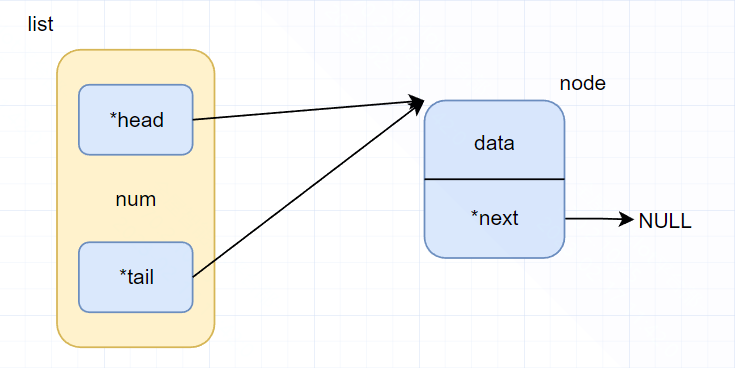
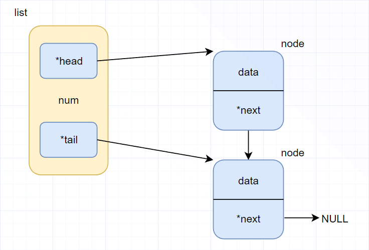
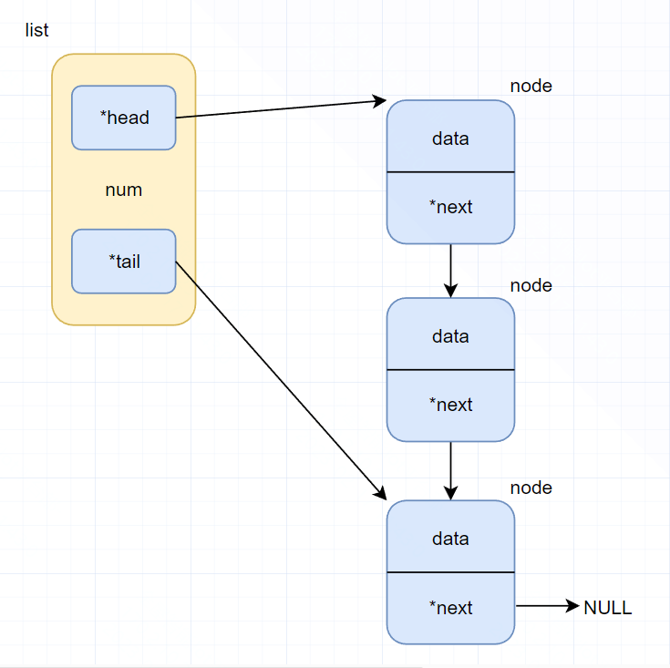

### 链表

```c
typedef struct node {
    void *data;
    struct node *next;
} Node;

typedef struct {
    Node *head;
    int num;
    Node *tail;
} List;
```

#### 1. 创建链表

```c
List *pt = NULL;
void *data = NULL;
pt = (List *)malloc(sizeof(List));

if(!pt) {
	return 0;
}

pt->head = NewChainNode(data, 0);
if(!pt->head) {
    free(pt);
    return NULL;
}

pt->node_num = 0;
pt->tail = pt->head;
```




#### 2. 添加第一个节点

```
newpt =  NewChainNode(data, datalen);

plist->node_num++;
plist->tail->next = newpt;
plist->tail = newpt;
```



#### 3. 添加第二个节点

```
newpt =  NewChainNode(data, datalen);

plist->node_num++;
plist->tail->next = newpt;
plist->tail = newpt;
```

